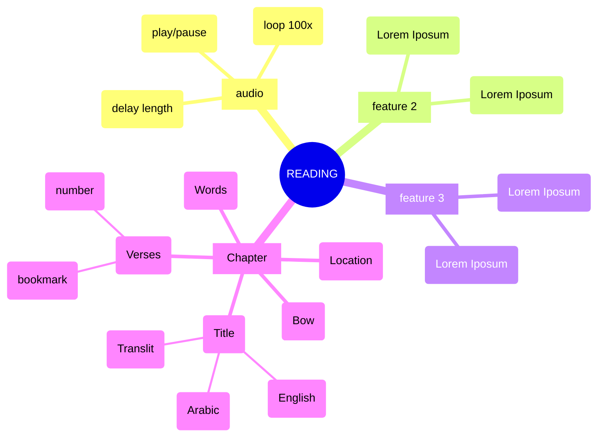
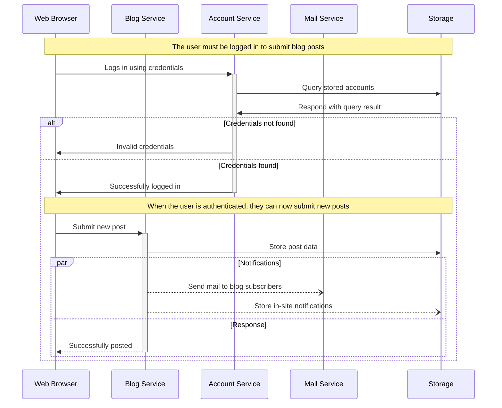

# mvp

- https://quranwbw.com/36 the first word plays the word below: 
- words: https://words.audios.quranwbw.com/36/036_001_001.mp3
- ayahs: https://everyayah.com/data/Alafasy_128kbps/036002.mp3
- MEGA SOURCE: https://github.com/risan/quran-json/tree/main
- major source 1 for data: https://github.com/qazasaz/quranwbw
- major source 2 for data: https://github.com/hablullah/data-quran
- major source 3 for data: https://github.com/gadingnst/quran-api
- major source 4 for data https://www.surequran.com/download/
- major source 5 for data https://everyayah.com/data/tools/
- major source 6 for data: https://corpus.quran.com/verbs.jsp?page=1

vscode extension: markdown preview mermaid support

## Blogging app service communication

