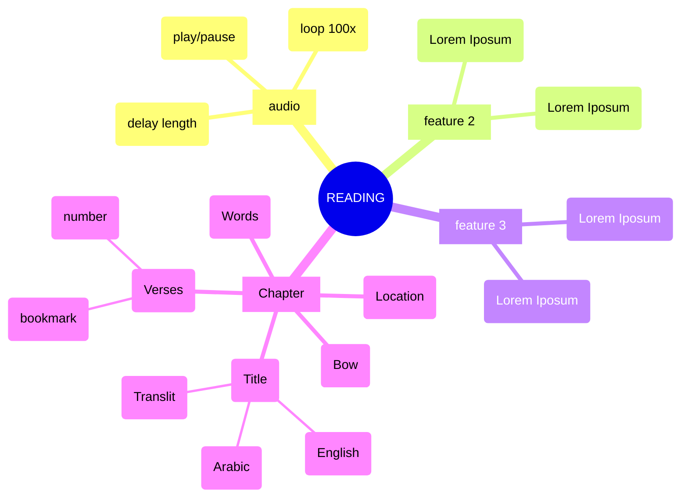
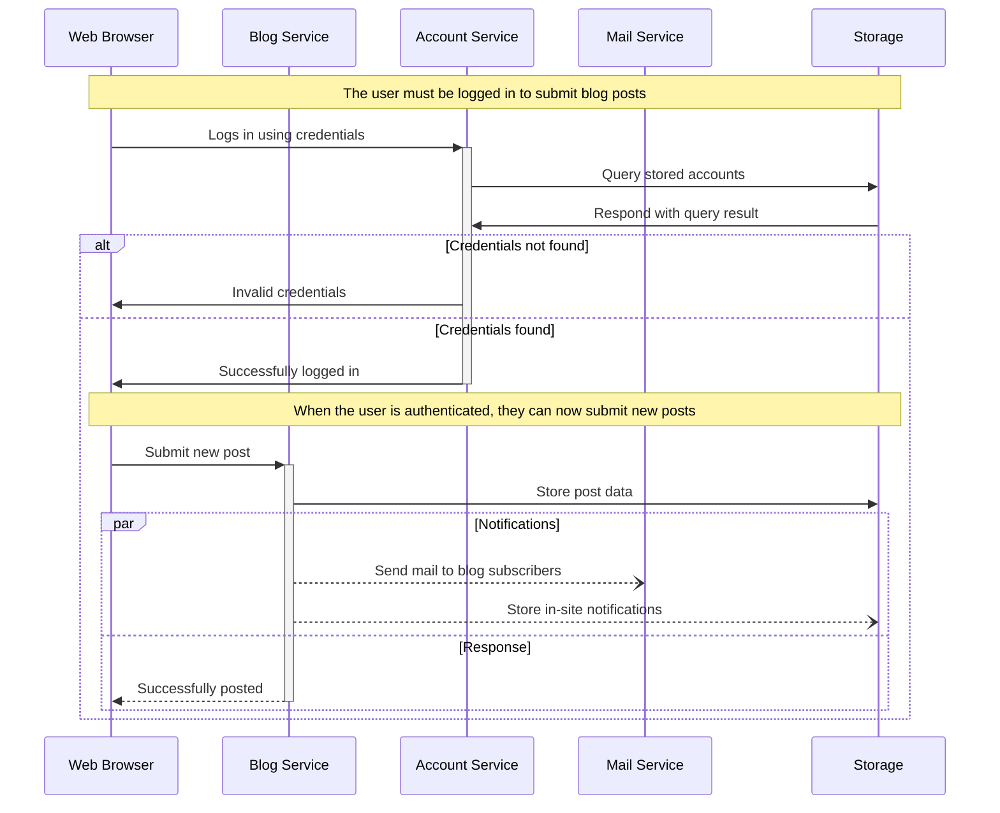

# mvp

This code is a jQuery function that handles a click event on elements with the class "sw" inside the container with the class "container". When clicked, it performs several actions including removing certain classes from elements, getting the parent class and id of the clicked element, adding a class to a specific child element, setting an audio file URL based on the parent class, id, and index of the clicked element, pausing any currently playing audio, loading and playing the new audio file, and handling the end of the audio playback by pausing the audio, resetting the playback time, and removing certain classes from elements. 
 
1. The code listens for a click event on elements with the class "sw" inside the container with the class "container". 
2. It prevents the event from bubbling up the DOM tree. 
3. It removes the classes "ayah-hover", "wa-hover", and "f-t-hover" from elements with the classes "a", "wa", and "f-t" respectively. 
4. It gets the third class and id of the parent element of the clicked element, as well as the index of the clicked element. 
5. It adds the class "wa-hover" to a specific child element based on the id and index. 
6. It constructs an audio file URL based on the parent class, id, and index. 
7. It removes any existing click event handler for elements with the class "bottom-nav__item bottom-nav-surahplayer" and adds a new one that pauses any currently playing audio. 
8. It pauses any currently playing audio, sets the source of the audio element to the constructed URL, loads the audio file, and plays it. 
9. It sets an event handler for when the audio playback ends, which pauses the audio, resets the playback time, and removes the classes "ayah-hover", "wa-hover", and "f-t-hover" from elements.

```js
$(".container").on("click", ".sw", function (a, c) {
  c = a || window.event;
  c.cancelBubble = !0;
  c.stopPropagation && c.stopPropagation();
  $(".a").removeClass("ayah-hover");
  $(".wa").removeClass("wa-hover");
  $(".f-t").removeClass("f-t-hover");
  var e = $(this).parent().parent().attr("class").split(" ")[2],
    b = $(this).parent().parent().attr("id"),
    d = $(this).index();
  $(".s-a#" + b + " .a")
    .children()
    .eq(d)
    .children(".wa")
    .addClass("wa-hover");
  e =
    e +
    "/" +
    ("00" + e).slice(-3) +
    "_" +
    ("00" + b).slice(-3) +
    "_" +
    ("00" + d).slice(-3);
  e = audio_url_words + e + ".mp3";
  $(".bottom-nav__item.bottom-nav-surahplayer")
    .off("click.audio")
    .on("click.audio", function () {
      audio.pause();
    });
  audio.pause();
  audio.src = e;
  audio.load();
  audio.play();
  audio.onended = function () {
    audio.pause();
    audio.currentTime = 0;
    $(".a").removeClass("ayah-hover");
    $(".wa").removeClass("wa-hover");
    $(".f-t").removeClass("f-t-hover");
  };
});
```
- https://quranwbw.com/36 the first word plays this audio https://words.audios.quranwbw.com/36/036_001_001.mp3
- MEGA SOURCE: https://github.com/risan/quran-json/tree/main
- major source 1 for data: https://github.com/qazasaz/quranwbw
- major source 2 for data: https://github.com/hablullah/data-quran
- major source 3 for data: https://github.com/gadingnst/quran-api
- major source 4 for data https://www.surequran.com/download/
- major source 5 for data https://everyayah.com/data/tools/

vscode extension: markdown preview mermaid support


## Blogging app service communication
